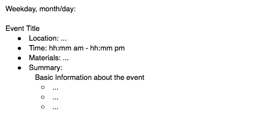

google-calendar-add
====================

Transform collaborative even planning from Google Document to individualized 
calendar entries. Different groups on campus need different levels of 
up-to-date information (e.g. advisors only need Location and Time, coordinators
need, Location, Time, Materials, and Summary, etc.), and this utility enables
each group to have a shared calendar with that info. 

## Input

Developed as a utility for RiceU's Orientation Week. Planning for each event for
the week was done in a Google Document in the following format: 



When downloaded as a text file from Google Docs, the format is as follows:

```
##Weekday, month/day:

#Event Title
* Location: ...
* Time: hh:mm am - hh:mm pm
* Materials: ...
* Summary:
    Basic information about event... 
       * ...
       * ...
       * ...
```

## Output

Running the python utility "python cal.py" with the correct app credentials 
(documented in cal.py) and a downloaded text file from Google Documents will 
parse the information above and build a calendar event for each entry in the 
following form: 

```
{
        'summary': event,
        'location': location,
        'start': {
          'dateTime': ,
          'timeZone': "America/Chicago"
        },
        'end': {
          'dateTime': ,
          'timeZone': "America/Chicago"
        },
        'description': ""
      }
```

## Future

App needs to be hosted on a simple website where the Google Doc file can be 
selected and run without hardcoding credentials. Also needs a parser in order 
to validate the data before the program is run. 
